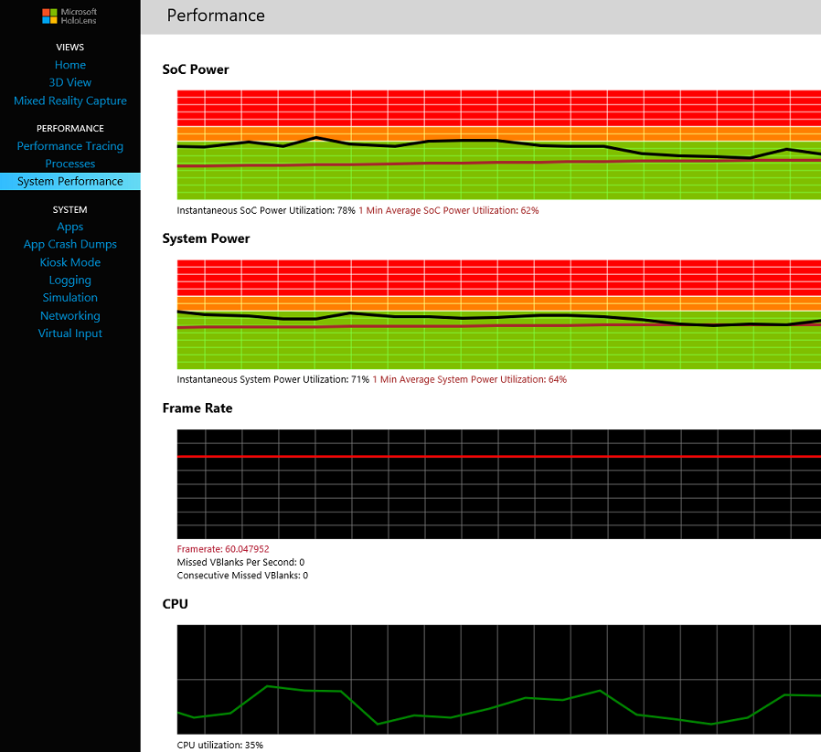
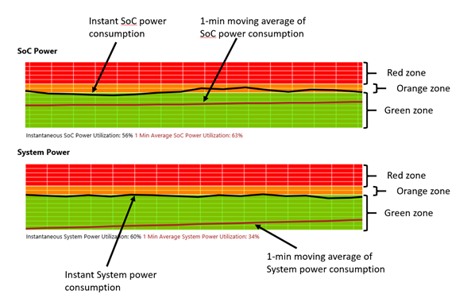

# HoloLens アプリのパフォーマンスの推奨事項

HoloLensでは、PC、スマートフォン、または外部カメラに有線接続することなく、没入型のホログラフィックエクスペリエンスを表現できます。これを実現するため、HoloLens はパッシブクーリングを備え、平均的ノートPCよりも優れたコンピューティング能力を有しています。このパッシブクーリングは放熱ファンを必要としないため、ユーザーエクスペリエンスを妨げる騒音が生じません。

センサーの処理は Holographic Processing Unit (HPU)にオフロードされます。この HPU は、HoloLens が取り込むカメラデータの処理に特化して設計されており、ホログラムの表示を安定させ、視線入力やジェスチャー入力をリアルタイムに追跡できるようにします。センサーフュージョンを HPU にオフロードすることで、ホストプロセッサをアプリに解放し、同時に、追跡インフラストラクチャのリアルタイム要件も確保します。

HoloLens アプリの開発は一般的なデスクトップアプリケーションの開発とは異なり、仮想世界の動きに合わせてユーザーの視野をすばやく更新する必要があります。ホログラフィックオブジェクトの外観を物理法則に従ってシミュレーションするには、両方の目にそれぞれ別の表示フレームを映し出す必要があります。ユーザーの動きに合わせて遅延を最小限に抑えながら映像表現を更新し、仮想世界のオブジェクトと現実世界のオブジェクトにずれが生じないようにしなければなりません。このため、ホログラフィックアプリのレンダリングパイプラインは、一人称視点の 3D ゲームのレンダリングパイプラインによく似ています。ただし、モバイルチップセットでは、フォワードレンダリングの能力は遅延パイプラインに比べて劣ります。

## 目次

-   [1.パフォーマンスのガイドライン](Performance%20recommendations%20for%20HoloLens%20apps.md#パフォーマンスのガイドライン)

-   [2.開発プロセスのガイダンス](Performance%20recommendations%20for%20HoloLens%20apps.md#開発プロセスのガイダンス)

-   [3.コンテンツのガイダンス](Performance%20recommendations%20for%20HoloLens%20apps.md#コンテンツのガイダンス)

-   [4.ツール](Performance%20recommendations%20for%20HoloLens%20apps.md#ツール)

    -   [4.1 Windows Device Portal -パフォーマンス](Performance%20recommendations%20for%20HoloLens%20apps.md#windows-device-portal---パフォーマンス)

    -   [4.2 システムパフォーマンス](Performance%20recommendations%20for%20HoloLens%20apps.md#システムパフォーマンス)

## パフォーマンスのガイドライン

ホログラフィックアプリで最適な没入型エクスペリエンスを実現するには、表示の複雑さ、表示フレームレート、レンダリングの遅延、入力の遅延、熱による電力消費、およびバッテリー寿命のバランスを取る必要があります。ユーザーが快適と感じるには、遅延を最小限に抑え、一貫して高いフレームレートを実現することが重要です。アプリでは、遅延を 1フレームに抑え、毎秒 60 フレーム (60 fps) を目標にしま。HoloLens のディスプレイパイプラインは、非常に高い頻度の追跡情報を基に表示するフレームを細かく修正することによって、ディスプレイのネイティブフレームレートに一致するようにアプリのフレームレートを高めることができるようにします。ユーザーのホログラフィック環境で、現実世界のオブジェクトのように動く安定したホログラムを実現するためには、このことが非常に重要になります。

アプリが目標のディスプレイレートを実現するようになったら、電力消費量を監視して、HoloLensの温度や電力の設計上の許容範囲内でアプリが確実に動作するようにします。

フレームレートと電力消費量はどちらも、HoloLens Device Management System Performance (HoloLens デバイス管理システムパフォーマンス)ビューで確認できます。

**最重要パフォーマンス目標**

|メトリック|目標|
|:-|:-|
|[*フレームレート*](https://developer.microsoft.com/ja-jp/windows/mixed-reality/Hologram_stability.html#frame_rate)|60 fps|
|電力消費量|1 分平均がオレンジゾーンおよびグリーンゾーン内。後半の「システムパフォーマンスツール」の情報を参照してください。|
|メモリ|総コミット 900 MB 未満|

ヒント: アプリが 60 fps 近くまで達していない場合、電力消費量が低くく示され、誤解が生じる可能性があります。そのため、アプリが目標のフレームレート近くまで達するようになってから、電力消費量を計測するようにしてください。

## 開発プロセスのガイダンス

HoloLensのレンダリングはリアルタイムで遅延が短いことを求められるため、開発プロセスのごく初期段階からパフォーマンスを意識することが非常に重要です。一般的ガイダンスとしては、できる限り開発サイクルの早い段階で[*60fps*](https://developer.microsoft.com/ja-jp/windows/mixed-reality/Hologram_stability.html#frame_rate)の達成を目指します。60 fps を達成したら、フレームレートを維持しながらの電力消費の監視に注力します。

消費電力を測定して最適化するときは、スクリプト化したウォークスルーをサポートすると非常に有効です。このようなウォークスルーを使用すれば、電力消費量とパフォーマンスを繰り返し測定できます。

## コンテンツのガイダンス

ここでは、アプリの広範な推奨事項、特に表示の複雑さについての推奨事項を取り上げます。こうした事項は一連のガイドラインで、厳しい制限ではありません。多くの場合、さまざまな効果や機能は、パフォーマンスと引き換えになる可能性があります。

**全般**

-   ピクセルのレンダリングの多くはボトルネックになるため、大量のピクセル描画や、負荷の高いシェーダーの使用は避けます。
    -   範囲を超えた描画は制限します。1 ～ 1.5倍の範囲を超えない描画を目指します。
    -   可能な場合は範囲を超えた描画、ジオメトリ、およびテクスチャサンプルを減らして、メモリ帯域幅を制限します。可能な場合は、Mip マップを使用します。
    -   複雑な表示やジオメトリに許容できる範囲で、解像度を落とすことを検討します。
    -   FXAA や SSAO など、全画面効果の使用は避けます。
-   描画呼び出しをバッチ処理し、DirectX のオーバーヘッドを最小限に抑えるインスタンス作成を使用します。
-   タスクの存在間隔に合わせて、CPU/GPU をすばやく休止状態にします。
-   16 ビットの深度バッファーを使用します。
-   プロジェクトで使用しない物理特性はオフにします。

**ジオメトリ**

-   左目と右目を組み合わせた視錘台に対して、視錘台カリングを実行します。
-   ある程度の頭の動きを考慮して、カリングする視錐台を約 5 度緩めます。
-   カリングには直前のフレームの頭部姿勢を使用し、実際のレンダリングには可能なかぎり最新の [*HolographicFrame*](https://developer.microsoft.com/ja-jp/windows/mixed-reality/rendering_in_directx) を取得します。
-   モデルの複雑さを調整し、遠方のホログラムには詳細レベルを下げたシンプルなメッシュを作成します。
-   Visual Studio のグラフィックツールを使用してシーンを測定し、頂点シェーダーやピクセルシェーダーがボトルネックになっているかどうかを確認して、適宜最適化します。
-   サブピクセルの三角形は非常に負荷が高くなります。
-   静的ジオメトリを前面から後面へと描画していくことで、見えないピクセルを描画しないようにします。
-   ジオメトリシェーダー、ハルシェーダー、および計算シェーダーは使用しません。
-   SpatialMapping メッシュを使用してホログラムを遮り、実際目に見える部分にこのメッシュをカリングします。
-   レンダリングするホログラムコンテンツに対して、SpatialMapping から受け取る三角形の数を調整します。
-   シーンをオクルージョンメッシュで事前に塗りつぶす場合は、深度バッファーにオクルージョンメッシュのみをレンダリングし、書き込みを避けるためにカラーバッファーにバインドしません。
-   シーンを後処理して遮られるピクセルを「消す」場合は、ホログラムをレンダリングするピクセルをマークするステンシルビットを設定し、オクルージョンメッシュをレンダリングする際にこのステンシルを利用します。
-   レンダリングクエリを使用して、他のホログラムで完全に遮られるオブジェクトや世界の空間マップをカリングします。
-   視界の中のホログラムの最も遠い点に遠方の平面を設定し、隠れるオブジェクトはできる限りレンダリングしないようにします。
-   骨格の頂点での影響の数を 1 か 2 に減らすと、骨格の変化によるオーバーヘッドが大幅に減り、フレームレートや電力消費量を抑えることができます。

**シェーダー**

-   多くの場合、ツールが作成する汎用シェーダーは複雑すぎます。HLSL でシェーダーを自作することで、この問題は回避できます。
-   GPU 使用量が高く、描画呼び出しの負荷が高いことを Visual Studio グラフィックツールが示している場合、その負荷を抑える手順がいくつかあります。
-   ボトルネックが頂点にあるか、ピクセルにあるかを簡単に区別するには、ViewportScaleFactor を使用して出力の解像度を下げます。これでパフォーマンスが向上する場合はピクセルにボトルネックが存在し、向上しない場合は高い確率で頂点シェーダーにボトルネックがあります。
-   ボトルネックが頂点シェーダーにあるか、CPU にあるかをを区別するには、位置計算をすべて実行しても白色を発するだけの、最小限の頂点シェーダーを作成します。これでパフォーマンスが向上する場合は頂点シェーダーにボトルネックが存在し、向上しない場合は高い確率で CPU に問題があり、おそらく DirectX 呼び出しの数が多すぎます。.
-   ホログラム間でのシェーダー切り替えは負荷が非常に高くなる可能性があるため、同じシェーダーですべてのオブジェクトを順番に送信するなど、描画呼び出しの並べ替えを検討します。
-   頂点の位置計算には完全な浮動小数点数 (float) を使用しますが、それ以外の計算には [*min16float*](https://msdn.microsoft.com/ja-jp/library/windows/desktop/hh968108%28v=vs.85%29.aspx) を使用します。シェーダーのアセンブリをチェックして、16 ビットを使用するようにします。間違って 32 ビットモードを使用するミスは簡単に起きます。たとえば、HLSL コンパイラは、32 ビットに上位変換するかよう警告を表示します。
-   HLSL 固有の「低レベルの」命令を使用して、ALU のスループットを最大限に引き出します。[*HLSL固有のリファレンス*](https://msdn.microsoft.com/ja-jp/library/windows/desktop/ff471376%28v=vs.85%29.aspx)を参照してください。
-   可能な場合は、個々の MULTIPLY 命令と ADD 命令を 1 つの [*MAD*](https://msdn.microsoft.com/ja-jp/library/windows/desktop/ff471418%28v=vs.85%29.aspx) 命令に組み合わせます。

**頂点シェーダー**

-   頂点シェーダーでは、頂点固有の計算のみを実行します。他の計算は、定数バッファーや追加の頂点属性に移します。
-   画面上の頂点の総数を減らせば、頂点シェーダーの命令数を減らすことができます。

**ピクセルシェーダー**

-   視界の大部分を覆うオブジェクトの場合、可能であれば各ピクセルを一度だけシェーディングします。
-   コンパイラ出力に応じて、ピクセルシェーダーの算術演算を約 48回に制限します。
-   ほとんどの場合、シェーダーの負荷はオブジェクトが占める画面領域に直接比例します。たとえば、SRに 30 命令シェーダーを置くことはありません。これは画面全体を占めることになります。
-   可能な場合は、ピクセルシェーダーから頂点シェーダーに作業を移します。たとえば、照明を頂点シェーダーに移して、内挿します。
-   テクスチャサンプルを 1 つに制限します。
-   静的分岐が役に立つことがあります。コンパイラ出力で静的分岐が選択されていることをチェックします。
-   大量の複雑なピクセルを排除できる場合は、動的分岐が役に立つことがあります。大半のピクセルが透明なシェーディングオブジェクトなどです。

**テクスチャサンプリング**

-   可能な場合はバイリニアを使用します。
-   トライリニアは慎重に使用します。
-   異方性フィルタリングは絶対に必要な場合のみ使用します。
-   可能な場合は DXT 圧縮と Mip マップを使用します。
-   16 ビットテクスチャ帯域幅を使用します。
-   ピクセルシェーダーがテクスチャ読み取り境界の場合、テクスチャ読み取り命令がシェーダーコードの先頭になるようにします。GPU はテクスチャデータのプリフェッチをサポートしません。

## ツール

|ツール|メトリック|
|:-|:-|
|HoloLens Device Portal パフォーマンスツール|電力、メモリ、CPU、GPU、fps|
|Visual Studio グラフィックスデバッガー|GPU、シェーダー、グラフィックスパフォーマンス|
|Visual Studio Diagnostic Tools (Visual Studio 診断ツール)|メモリ、CPU|
|Windows Performance Analyzer|メモリ、CPU、GPU、fps|

### Windows Device Portal - パフォーマンス

HoloLens Device Portal では、以下のパフォーマンスツールを提供しています。

-   Performance Tracing (パフォーマンス追跡) - このページでは、パフォーマンスデータをキャプチャして、WindowsPerformance Analyzer を使ってそのデータを分析できます。
-   Processes (プロセス) - 現在実行中のプロセスと関連プロセス情報を表示します。
-   System Performance (システムパフォーマンス) - 電力消費量、CPU 使用量、GPU 使用量、ディスク I/O、メモリ、フレームレートなど複数のメトリックをリアルタイムに追跡します。

### システムパフォーマンス

HoloLensは、さまざまな外気温の環境で機能するように設計されています。HoloLens の許容限界温度を超えると、フォアグラウンドアプリがシャットダウンされ、デバイスを冷却できるようになります。温度は、外気温、エクスペリエンスによる電力消費、エクスペリエンスの使用時間という 3 つの変数に応じて異なります。これらの 3 つの変数と HoloLens の耐熱機能の関係を以下に示します。

システムパフォーマンスページには、SoC 電力消費量、システム電力消費量、デバイスのフレームレート、CPU と GPU の使用量、ディスク I/O、ネットワーク帯域幅、メモリ使用量のパフォーマンスデータがリアルタイムに表示されます。

**System power (システム電力消費量)** システム電力消費量には、HoloLens の電力総使用量が示されます。これにはアクティブなセンサー、ディスプレイ、スピーカー、GPU、CPU、メモリなど、すべてのコンポーネントの電力消費量が含まれます。HoloLens の充電中は、システム電力消費量を測定できません。そのため、充電中はシステム電力消費量がゼロに低下します。

**SoC power (SoC 電力消費量)** SoC 電力消費量には、CPU、GPU、メモリの合計電力消費量が表示されます。さらに CPU と GPU の使用量を使って、どちらの電力消費量が大きいかを判断できます。メモリ転送には大量の電力が必要になるため、メモリ帯域幅を最適化することで、SoC 電力消費量を削減できることにも注意します。

Soc 電力消費量とシステム電力消費量のグラフには、現在の電力消費量と 1 分間の平均電力消費量が示されます。アプリ起動中など、短時間の電力負荷の上昇は容認できます。

グリーンゾーン: アプリの電力消費量は、デバイスの許容範囲内に適切に収まっています。

オレンジゾーン: 外気温が上昇している環境でも、オレンジゾーンのアプリの動作は許容範囲内です。

レッドゾーン: オフィスや通常の生活環境など特に涼しい環境では、レッドゾーンのアプリの動作が許容範囲内になる場合もあります。

**Frame Rate (フレームレート)**

レンダリング層または合成層のフレームレートを表示します。ホログラムを集中的に操作するアプリの実行中は、ディスプレイスタックが完全に制御されるため、表示されるフレームレートはそのアプリのフレームレートになります。Holographic Shell にピン留めされる従来の 2D ストアアプリのフレームレートの測定に、このカウンターを使用することはできません。Holographic Shell で従来の 2D アプリのフレームレートを測定するには、そのアプリでフレームレートを表示する必要があります。

**CPU**

CPU のコアが、アイドルスレッド以外のスレッドを実行している時間の割合です。100％ は、プロセッサのすべてのコアが使用されていることを表します。

**GPU**

GPU がグラフィックタスクまたは計算タスクでアクティブになっている時間の割合です。

**I/O**

すべてのプロセスの読み取りと書き込みのディスク帯域幅です。

**Network (ネットワーク)**

すべてのプロセスのネットワーク送受信帯域幅です。

**Memory (メモリ)**

1 つのアプリの HoloLens でのメモリ制限は 900 MB です。この制限を超えると、リソースマネージャーがそのアプリを終了します。

システムパフォーマンスのメモリのグラフには、すべてのプロセスがコミットするメモリの総数がデバイス別に表示されます。個々のプロセスのメモリ情報については、Processes(プロセス)タブを参照してください。
